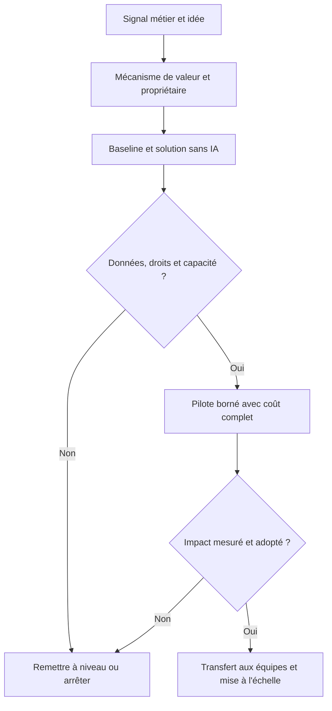
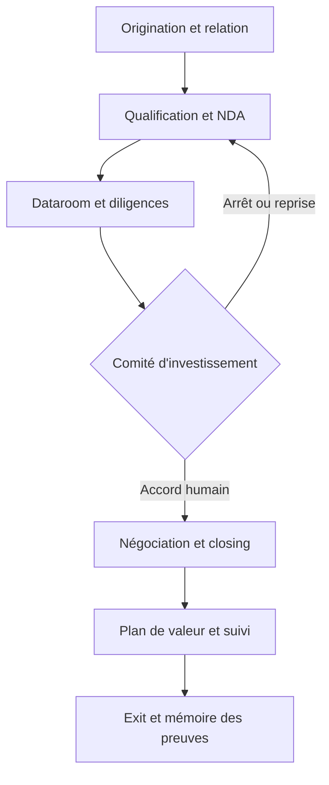
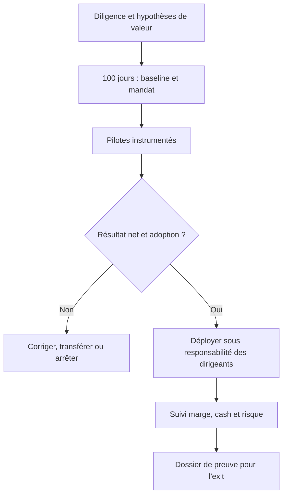

# Hivest | Faire évoluer une vocation de transformation

**Note stratégique de discussion — François Arnaud · 24 septembre 2026 · horizon 2027–2030**  
**Statut : proposition argumentée ; aucun diagnostic des capacités internes de Hivest n'est présumé.**

## Sommaire

1. [Thèse et arbitrage](#1--la-prochaine-étape-de-la-transformation-appartient-déjà-au-métier-de-hivest)
2. [Pourquoi maintenant](#2--une-évolution-progressive-avec-une-fenêtre-de-marché-réelle)
3. [Forward deployment et investigation](#3--forward-deployment--une-capacité-opératoire-partagée-sous-mandat-des-dirigeants)
4. [Dealflow et investissement augmenté](#4--investissement-augmenté--traiter-plus-dinformation-sans-diluer-le-jugement)
5. [Économie et gouvernance](#5--économie-revenus-et-confiance--trois-comptes-à-ne-jamais-mélanger)
6. [Mandat et mise à l'échelle](#6--un-mandat-qui-dure-au-delà-des-premiers-pilotes)
7. [Sources et limites](#7--sources-périmètre-et-limites-de-transfert)

---

## 1 — La prochaine étape de la transformation appartient déjà au métier de Hivest

**Proposition.** Hivest a une raison plus forte que l'effet de mode pour structurer une capacité data et IA : sa thèse publiée consiste à reprendre des entreprises familiales ou des activités non stratégiques et à libérer leur potentiel par la croissance et la transformation opérationnelle. La question utile n'est donc pas « faut-il devenir un fonds d'IA ? », mais **comment mieux instruire une transformation, la réaliser avec les dirigeants et capitaliser ce qui a été appris au deal suivant**. [S1]

Deux chantiers se renforcent : **forward deployment**, auprès des participations, depuis la diligence jusqu'aux opérations et à la croissance ; **investissement augmenté**, dans l'origination, la lecture des dossiers, la décision et le suivi. Un troisième sujet, la vente de services, doit rester une option testée à part : une facture émise par le GP n'est pas en soi une création de valeur pour le fonds ou ses investisseurs. [S11–S12]

L'histoire est déjà visible dans le portefeuille : Hivest décrit l'acquisition de Kuzzle par Agora Makers comme le passage d'actifs industriels à une proposition combinant équipements, IoT, logiciel, données et services récurrents. **Fait documenté :** c'est la stratégie annoncée pour Agora Makers. **Inférence :** le fonds pourrait transposer une méthode de transformation, avec des modalités différentes, à d'autres actifs. Cela ne démontre ni la maturité IA ni le potentiel financier de ces derniers. [S2]

**Décision à explorer avec les associés.** Mandater un responsable transversal, rattaché aux associés et associé aux équipes d'investissement et aux dirigeants, pour tester deux boucles courtes : une chaîne pré-deal contrôlée et un cas de valeur opérationnelle sur chacun des deux pilotes Sphere et STG. Le programme du dépôt Hivest est précisément au stade `PILOTS` ; ses gates humains et ses preuves restent ouverts. Ce document ne les franchit pas. [R1]

---

## 2 — Une évolution progressive, avec une fenêtre de marché réelle

Le chemin **digital → données → analytique et ML → IA générative → automatisation → robotique** n'est pas une marche imposée à chaque entreprise. Dans une usine, connecter ERP, qualité et atelier peut créer plus de valeur qu'un agent conversationnel ; dans une autre, une règle de maintenance suffit. L'investisseur doit demander : *quelle contrainte de marge, qualité, service, capacité, BFR ou croissance cette capacité lève-t-elle ?* Puis établir un point de départ mesuré avant de projeter un bénéfice. [S3–S5]

Le mouvement des pairs existe. Dans une enquête BCG auprès de **100 investisseurs** publiée en janvier 2026, 73 % déclarent réaliser une diligence digitale sur la plupart des dossiers, mais seuls 22 % disent que la préparation digitale influe sur le go/no-go. Cet écart décrit une **pratique déclarée du panel**, pas la pratique de Hivest ni une causalité de performance. BCG rappelle que les systèmes et données de base conditionnent une IA rentable. [S3]

Du côté des cibles, Bpifrance Le Lab estime à **370 000** les entreprises françaises susceptibles d'être transmises d'ici 2030 ; **64 % des intentions** de transmission sont déclenchées par la perspective du départ à la retraite. Le premier nombre est un bassin de transmission, **pas** un flux additionnel de dossiers LBO éligibles à Hivest : taille, qualité, propriétaire, concurrence, dette et calendrier filtrent l'univers. Il justifie surtout un meilleur système de détection, qualification et mémoire relationnelle. [S4]

Dans l'industrie, les exemples récents rendent la trajectoire concrète. Tesa décrit la réunion des données de machines, ERP et services pour analyser les opérations ; sa détection d'anomalies par ML est formulée comme **une ambition future**, tandis que ses capteurs et ses tableaux de bord existent déjà. Toyota Motor North America rapporte une baisse du temps de résolution d'un incident d'usine de sept jours à deux heures dans un témoignage Datadog : c'est une histoire d'observabilité et de coordination, pas un ROI de modèle génératif transposable. Unither Pharmaceuticals décrit, chez Qlik Talend, l'unification et la qualité de flux soumis aux exigences GxP ; SLB présente, chez Dataiku, une maintenance prédictive bâtie avec ingénieurs et data scientists, avec une réduction de 55 % des temps d'arrêt **dans ce cas déclaré**. Les quatre histoires couvrent fondations, visibilité et ML ; aucune ne constitue une prévision pour une participation Hivest. [S5–S6, S20–S21]

**Une histoire à raconter aux dirigeants :** « Nous avons déjà transformé le commerce, les processus, les systèmes et les organisations. La donnée et l'IA étendent ce répertoire. Nous commençons par vos contraintes industrielles et votre équipe, puis choisissons la technique qui fait ses preuves. » Le recueil Greenfield fourni décrit un Bureau de la transformation (pilotage, méthode, feuille de route, accompagnement, veille) et trois horizons (optimiser, reconfigurer, repositionner). C'est une **grille d'auteur**, utile pour composer le mandat, sans constituer une étude indépendante de Hivest. [G1]

---

## 3 — Forward deployment : une capacité opératoire partagée, sous mandat des dirigeants

La chaîne de valeur commence avant l'entrée au capital. **En diligence**, tester l'état des données, le coût de remise à niveau, les dépendances fournisseurs et la capacité managériale ; inscrire les travaux indispensables dans le plan de valeur, ou diminuer la thèse si le chantier excède l'horizon de détention. **Dans les 100 premiers jours**, co-définir avec CEO, COO, DSI et fonctions de contrôle deux ou trois problèmes chiffrables, la baseline, un propriétaire et le scénario sans IA. **En exploitation**, instrumenter la qualité, l'adoption, les incidents, la marge et le cash ; transmettre l'exploitation aux équipes locales. [S3, S7]

La structure peut rester légère : un leader transverse au fonds, des partenaires industriels/digitaux mobilisés au cas par cas, des managers propriétaires dans chaque société, et un registre des apprentissages réutilisables. AI Partners rend lisible ce type de chaîne en trois pôles publics — **AI Academy**, **AI First Organization**, **AI Factory** — avec diagnostic, design, déploiement et adoption. Son cas Vetoquinol décrit un expert dédié, des points stratégiques mensuels et des revues d'impact trimestrielles : une histoire d'accompagnement continu plutôt que de déploiement ponctuel. C'est un **comparateur de packaging de services**, pas un organigramme à copier ni une preuve d'impact chez Hivest. Ses chiffres de cas clients sont auto-déclarés. [S8]

Le précédent de Siparex et Bpifrance est plus proche du terrain français : leur ouvrage d'avril 2026 décrit vingt cas de PME/ETI, une méthode issue de plus de 1 500 accompagnements, et l'association entre priorisation, gouvernance et formation. Il offre des ordres de grandeur de projets observés **dans leur sélection**, non une estimation du rendement du portefeuille Hivest. [S9]

Le contraste des pairs est instructif. Blackstone regroupe dans ses Portfolio Operations talent, data science et IA, cybersécurité, achats et excellence opérationnelle ; son équipe data contribue aussi à l'investissement. Hg Catalyst construit des produits IA avec ses participations logicielles et revendique de nouveaux revenus **dans les sociétés**. Hivest, avec un portefeuille majoritairement industriel, gagnerait à adapter la gouvernance et le transfert de compétence, sans répliquer les effectifs ou la nature du portefeuille de ces grands groupes. [S10–S11]

### Méthode d'investigation, de l'idée à l'échelle

Chaque passage exige une preuve, un responsable et une condition d'arrêt ; l'idée seule ne vaut jamais bénéfice réalisé.

**Gates de valeur par participation.** (i) Une douleur P&L, cash ou risque, mesurée ; (ii) un jeu de données accessible et autorisé ; (iii) un manager qui accepte d'arbitrer les rôles ; (iv) une solution classique comparée ; (v) des coûts de construction, exploitation et supervision ; (vi) une condition d'arrêt. Pour Sphere et STG, aucune recommandation opérationnelle ne doit devancer les preuves et les décisions de leurs dossiers pilotes. [R1]

---

## 4 — Investissement augmenté : traiter plus d'information sans diluer le jugement

L'opportunité n'est pas une machine à « décider des deals ». C'est la continuité des preuves et des questions, du premier signal à l'exit. BCG décrit en 2026 une M&A où sourcing, diligence, valorisation et négociation s'appuient sur une mémoire institutionnelle ; l'enjeu organisationnel est la qualité des données et la gouvernance autant que l'outil. [S12]

### Parcours d'un dossier et contrôles humains

| Étape | Intervention contrôlée | Preuve attendue et décision humaine |
|---|---|---|
| Origination / pipeline | Déduplication d'entités, signaux de transmission ou de build-up, historique relationnel | Source datée, identité vérifiée ; investment team décide de l'approche. |
| Qualification / NDA | Extraction de critères, préparation de questions et de la liste de documents manquants | Périmètre, confidentialité et droits ; analyste rejette les faux positifs. |
| Dataroom / diligence | Recherche à permissions, citations au passage, rapprochement contrats-comptes-KPI | Document/version/page, contradiction, champ inconnu ; experts valident les conclusions. |
| Comité / négociation | Scénarios et red-team de la thèse, comparaison de cas analogues | Hypothèses, sensibilité et propriétaire ; aucun score automatique d'investissement. |
| Post-deal / exit | Suivi du plan de valeur, alertes d'écarts, dossier de preuve pour acquéreur | CFO/COO attestent chiffres, causalité et continuité des contrôles. |

Le logiciel est suffisamment constitué pour **évaluer** une solution par fonction, sans présumer l'intégration à la dataroom du fonds : Sinequa décrit une recherche transverse à sources et permissions pour PE ; DilBloom annonce l'analyse de datarooms, PDF et tableaux en environnement sécurisé ; Accelex et Canoe se concentrent notamment sur la collecte et l'extraction de documents de private markets. Ce sont des **capacités annoncées par leurs éditeurs**, à éprouver sur un dossier autorisé, et non une recommandation fournisseur. Leurs cibles se recoupent imparfaitement : Canoe et Accelex couvrent aussi les flux LP/fonds de fonds ; la diligence directe d'une PME industrielle a d'autres exigences. [S13–S16]

**Pilote pré-deal de 90 jours :** sélectionner un dossier clos et un dossier vivant dont les droits sont clarifiés ; mesurer le temps de recherche, les oublis matériels, la précision des citations, les erreurs de rapprochement et le taux de questions utiles ; comparer au processus courant. Un seul incident de cloisonnement ou une conclusion critique sans source arrête l'essai. L'expérience de François en gestion d'actifs et dans la structuration d'outils et de processus IA à Amundi est **un point de départ professionnel déclaré**, à illustrer en entretien par des réalisations partageables et des chiffres qu'il peut confirmer ; elle n'établit pas à elle seule une expertise juridique ou financière de l'acquisition. [P1]

---

### Boucle post-deal jusqu'à la transmission

## 5 — Économie, revenus et confiance : trois comptes à ne jamais mélanger

**Compte 1 — participation :** croissance, marge, fonds de roulement, dépenses évitées et risques contrôlés, nets des coûts de transformation. Un temps gagné ne devient EBITDA que si la capacité est réaffectée, les coûts réellement évités ou le revenu incrémental observé. Le cash libéré n'est pas de l'EBITDA récurrent. **Compte 2 — fonds/LP :** meilleur choix de dossiers, vitesse raisonnable, performance à l'exit après coût et risque. **Compte 3 — GP :** rémunération d'une éventuelle activité de services et sa contribution nette après ressources, prix de marché, frais, offsets et accords avec les investisseurs. Il est possible que le compte 3 progresse sans améliorer le compte 2. [S17]

Un exemple outre-Atlantique prouve **l'existence d'un modèle**, pas sa pertinence automatique : les états de KKR décrivent des honoraires de suivi et de conseil négociés avec certaines participations. Des documents SEC de Blackstone décrivent des frais de services et des mécanismes de réduction des management fees au bénéfice des investisseurs selon les accords. Toute extension de ce modèle chez Hivest demanderait examen des documents de fonds, des conflits d'intérêts, de la gouvernance du prix et de l'intérêt des participations ; l'autofacturation ne doit jamais être présentée comme création de valeur nette. Une voie plus claire peut consister à vendre **par les participations** de nouveaux services à leurs propres clients quand leur proposition de valeur l'autorise, à l'image de la logique revendiquée par Hg Catalyst. [S11, S17–S18]

La confidentialité n'est pas une simple case de conformité : la dataroom mêle secrets d'affaires, données personnelles, clauses de non-divulgation et parfois restrictions d'usage imposées par le vendeur. Architecture à évaluer : segmentation par transaction et société, droits minimaux, consentement/contrat d'accès, journalisation, durée de conservation, suppression, traitement par sous-traitants et tests de fuite entre dossiers. La CNIL demande des garanties de sécurité et une qualification claire des responsabilités du sous-traitant. La souveraineté se juge sur localisation, accès juridique et opérationnel, portabilité et continuité ; aucune marque ne règle seule ces questions. [S19]

**Question contradictoire à poser au comité :** si l'IA accélère le screening mais multiplie les cibles faiblement pertinentes, ajoute de la revue humaine et augmente les coûts, quel indicateur prouve une meilleure décision ? Réponse proposée : mesurer par cohorte la qualité des dossiers passés en diligence, la découverte d'un risque matériel et la vitesse jusqu'à une décision documentée, avec un groupe de comparaison et les coûts complets.

---

## 6 — Un mandat qui dure au-delà des premiers pilotes

| Horizon | Livrable et responsable proposé | Condition pour continuer |
|---|---|---|
| 0–90 jours | Associé sponsor + leader transformation : cartographie du processus d'investissement, test sécurisé sur deux dossiers, baseline et décisions pilotes Sphere/STG selon les gates du dépôt. | Sources autorisées, zéro incident critique, managers engagés, mesure de référence. |
| 3–12 mois | Investment team + CEO/COO/DSI : deux à quatre cas à valeur vérifiée, playbook diligence→100 jours→exploitation, registre de réutilisation et de contre-exemples. | Gain net ou risque évité attribuable ; possibilité de transfert et de maintien local. |
| 1–3 ans | Comité de portefeuille : capacité partagée, réseau de responsables dans les participations, doctrine sécurité/données et dossiers d'exit étayés. | Répétabilité entre secteurs démontrée sans imposer un même outil. |
| 3–5 ans | Associés : réexaminer les modèles de services, la place des produits dans les participations et la taille du dispositif central. | Accords LP, gouvernance économique et demande externe vérifiés ; option NO-ACTION conservée. |

**Posture proposée pour François.** « Je souhaite relier la thèse d'investissement à l'exécution, avec un mandat durable : qualifier les opportunités avant le deal, aider les équipes dirigeantes à transformer leurs flux, rendre les apprentissages réutilisables et laisser les décisions aux personnes qui en portent la responsabilité. » La valeur du poste évoluerait avec les preuves : d'abord conception et orchestration, ensuite animation du dispositif, puis éventuel développement d'une capacité de services si ses conditions sont réunies. L'expérience Amundi sert à expliciter une méthode de gouvernance et de passage à l'échelle ; les décisions de LBO et l'exploitation industrielle restent sous l'autorité des spécialistes et des dirigeants. [P1]

**Ce qui infirmerait la proposition :** faible volume de dossiers où la recherche est réellement limitante ; faiblesse des données sources ; cas de valeur inférieurs aux méthodes existantes ; absence d'adhésion des dirigeants ; coûts de support supérieurs aux gains ; incompatibilité des documents de fonds avec la facturation envisagée. Sans ces vérifications, la bonne décision est de poursuivre un pilote limité, pas d'annoncer une « AI factory Hivest » déjà prouvée.

---

## 7 — Sources, périmètre et limites de transfert

Sources consultées au 24/09/2026. Les pages de fournisseurs et de conseils décrivent leurs propres offres et études ; leurs résultats ne sont pas extrapolés à Hivest. Le recueil Greenfield est traité une seule fois, en source de méthode.

- **[S1]** [Hivest, clôture Hivest II, 01/09/2022](https://hivestcapital.com/hivest-ii-atteint-son-hard-cap-de-300-millions-deuros/) : thèse et rôle opérationnel déclarés.
- **[S2]** [Hivest, Kuzzle/Agora Makers, 2026](https://hivestcapital.com/en/hivest-capital-announces-the-acquisition-of-kuzzle-by-agora-makers/) : logique annoncée du build-up et des services récurrents.
- **[S3]** [BCG, *Private Equity’s Future Is Digital First and AI Powered*, 07/01/2026](https://www.bcg.com/publications/2026/private-equitys-future-digital-first-and-ai-powered) : enquête de 100 investisseurs ; biais déclaratif et association, non causalité.
- **[S4]** [Bpifrance Le Lab, *Transmission en France*, étude 2025–2026](https://lelab.bpifrance.fr/transmission) et [communiqué](https://presse.bpifrance.fr/transmission-et-reprise-dentreprise-un-potentiel-de-marche-eleve-mais-des-freins-a-lever-pour-faciliter-les-transactions/?lang=fra) : bassin et intentions, non dealflow Hivest.
- **[S5]** [Snowflake/tesa, témoignage client](https://www.snowflake.com/en/customers/all-customers/case-study/tesa/) : état déjà déployé séparé des ambitions ML.
- **[S6]** [Datadog/Toyota Motor North America, témoignage client](https://www.datadoghq.com/case-studies/toyota/) : indicateur d'incident, non résultat d'IA générative.
- **[S7]** [BCG, *AI-First Companies Win in Private Equity*, 2025](https://www.bcg.com/assets/2025/executive-perspectives-ai-first-companies-private-equity.pdf) : diligence, capacité et plan de valeur.
- **[S8]** AI Partners, [accueil](https://weareaipartners.com/fr), [Academy](https://weareaipartners.com/fr/ai-academy), [Organization](https://weareaipartners.com/fr/ai-first-organization), [Factory](https://weareaipartners.com/fr/ai-factory), [index des cas](https://weareaipartners.com/fr/use-case), [Vetoquinol](https://weareaipartners.com/fr/use-case/vetoquinol), [Adisseo](https://weareaipartners.com/fr/use-case/adisseo), [livres blancs](https://weareaipartners.com/fr/white-paper) : offre et récit commerciaux, pages structurelles et cas pertinents consultés ; pas de capture exhaustive du domaine.
- **[S9]** [Siparex/Bpifrance, *Les audacieux de l'IA*, communiqué du 16/04/2026](https://presse.bpifrance.fr/siparex-et-bpifrance-publient-un-ouvrage-exclusif-sur-limpact-chiffre-de-lintelligence-artificielle-dans-les-pme-eti-francaises/?lang=fra) : panel sélectionné et retour d'expérience attribué.
- **[S10]** [Blackstone, Portfolio Operations, 27/02/2025](https://www.blackstone.com/news/press/blackstone-appoints-rodney-zemmel-as-global-head-of-portfolio-operations/) et [Data Science](https://www.blackstone.com/data-science/) : modèle pair, échelle différente.
- **[S11]** [Hg, lancement de Catalyst, 17/11/2025](https://hgcapital.com/insights/hg-launches-catalyst-a-new-ai-incubator) : cas de produit et revenus **dans les participations**, principalement logiciel.
- **[S12]** [BCG, *AI Is Turning M&A into a High-Impact Learning Machine*, 10/06/2026](https://www.bcg.com/publications/2026/ai-is-turning-m-and-a-into-a-high-impact-learning-machine) : argument du processus apprenant.
- **[S13]** [Sinequa, solution Private Equity](https://www.sinequa.com/solutions/sinequa-for-private-equity/) : capacités annoncées.
- **[S14]** [DilBloom, présentation](https://dilbloom.ai/about.html) : capacités annoncées et hypothèses de souveraineté à vérifier contractuellement.
- **[S15]** [Accelex, plateforme](https://www.accelextech.com/) : documents d'alternatifs ; périmètre LP à distinguer du direct.
- **[S16]** [Canoe, ebook 2026](https://canoeintelligence.com/ai-ebook/) : collecte et extraction d'alternatifs, documentation commerciale.
- **[S17]** [SEC, rapport KKR 2025, note frais de conseil/suivi](https://www.sec.gov/Archives/edgar/data/1404912/000140491226000007/R14.htm) : existence de frais négociés, sans transposition réglementaire automatique.
- **[S18]** [SEC, rapport Blackstone 2025, offsets de management fees](https://www.sec.gov/Archives/edgar/data/1393818/000119312526082531/R34.htm) : exemple de redistribution contractuelle.
- **[S19]** [CNIL, gérer la sous-traitance](https://www.cnil.fr/fr/securite-gerer-la-sous-traitance) et [gestion des données pour IA](https://www.cnil.fr/fr/tenir-compte-de-la-protection-des-donnees-dans-la-collecte-et-la-gestion-des-donnees) : contrôle des accès et sécurité.
- **[S20]** [Qlik Talend/Unither Pharmaceuticals, témoignage client](https://www.qlik.com/us/solutions/customers/customer-stories/unither-pharmaceuticals) : intégration et qualité des données dans un environnement GxP.
- **[S21]** [Dataiku/SLB, témoignage client du 21/09/2026](https://www.dataiku.com/blog/slb) : maintenance prédictive, résultats déclarés par les parties, non transférables.
- **[G1]** Gabriel Greenfield, *Best of Greenfield — S1 2026*, PDF fourni une fois, articles 07 (pages physiques 27–29), 24 (97–99), 35 (130–132), 36 (133–135). Opinion et modèle de praticien ; chiffres secondaires non repris sans primaire.
- **[R1]** Dépôt Hivest, `AGENTS.md` et `program/state.json`, état lu le 24/09/2026 : programme PILOTS, gate humain ouvert ; les dossiers d'entreprises ne sont pas validés par cette note.
- **[P1]** Parcours communiqué par François : expérience de transformation IA et gestion d'actifs à Amundi. Claims chiffrés et exemples personnels à autoriser avant diffusion externe.

**Angles non clos.** L'identité et le produit de « Corporating » n'ont pas été confirmés par une source primaire fiable ; nom absent des comparateurs retenus. France Invest dispose d'une enquête IA dans le capital-investissement datée de 2024, mais son PDF n'a pas pu être lu intégralement dans cette passe : aucune statistique ne lui est attribuée. Les corpus complets Dataiku/Qlik Talend et l'ensemble du domaine AI Partners restent à inventorier si un benchmark fournisseur ou une monographie sectorielle est demandé ; les pages et cas publics retenus étayent ici les mécanismes. Aucune donnée interne de Hivest (dealflow, coût d'analyse, accords LP, budget, baseline des participations) n'a été fournie : toutes les projections financières restent ouvertes.
